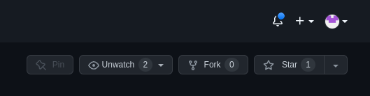
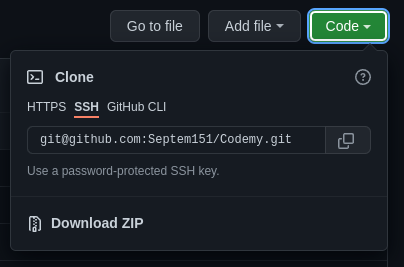
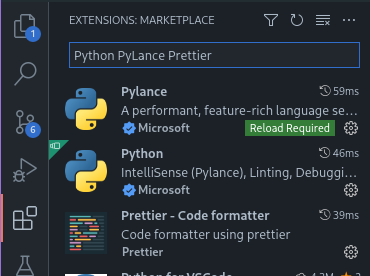
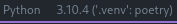
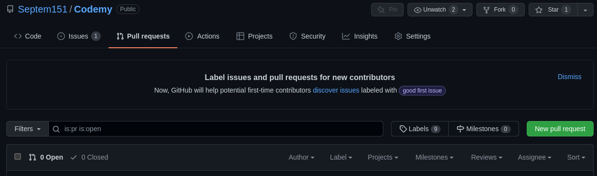

######
Codemy
######

Codemy is a discord bot for an idle-RPG style game relating to the profession
of coding.

************
Contributing
************

Running Codemy locally lets you debug and test the bot's functionality before
integrating code changes into the repository.

=============
Prerequisites
=============

To run Codemy locally, you will need to have the following prerequisites
installed:

* `Git`_
* `Visual Studio Code`_
* `Python`_ (>=3.10)
* `Poetry`_

  * ``Poetry`` is a dependency management and packaging tool for Python,
    similar in functionality to ``npm`` or ``yarn`` for JavaScript.

All other dependencies will be installed in a virtual environment when
running Poetry.

.. note::
  If this is your first time using ``Poetry``, consider changing the config
  to create virtual environments in the project's root directory by running::

    $ poetry config virtualenvs.in-project true

============
Installation
============

Installing Codemy is relatively straight-forward. This section will walk you
through how to fork this repository on GitHub, clone the repository to your
local machine, make changes in code and test those changes, and finally how
to submit changes as a Pull Request to the parent repository.

----------------
Forking the Repo
----------------

At the top-right of the repository page, click "Fork":

Forking the repository will create an identical copy of the repository to
your own GitHub account, which gives you the ability to make changes and
commits freely without restrictions.

----------------
Cloning the Repo
----------------

First, you must clone your forked repository to your local machine.
Run the following command in your terminal (Git Bash if you
are on Windows)::

  $ git clone [URL]

The ``[URL]`` you use will depend on if you select SSH or HTTPS under the
"Code" dropdown:

This will download your forked repository's code to your machine into
a folder in the directory where you ran the command called ``Codemy``.

-----------------------
Installing Dependencies
-----------------------

``Poetry`` will manage all project dependencies and the virtual environment.

First, enter the newly created directory from the previous step::

  $ cd Codemy

Then, install dependencies and create the virtual environment by running::

  $ poetry install

=================
Environment Setup
=================

It's recommended to use Visual Studio Code for this project. To maintain
consistent styling, formatting, and linting, the ``.vscode/settings.json``
file will utilize some `extensions`_:

* **Python** by Microsoft
* **Pylance** by Microsoft
* **Prettier - Code formatter** by Prettier

These extensions will provide opinionated auto-formatting on save,
and linting for finding errors quickly.

To install extensions in VS Code, click on the Extensions tab on the
left-hand side:

When opening the project in VS Code, the virtual environment created
by poetry should automatically be detected when opening a python file.
To test this, open ``codemy/__init__.py`` and look for
"Python  3.10.X ('.venv': poetry)" at the bottom-right:

You're all good to start making changes and writing code!

===================
Running the Project
===================

There are multiple ways to run the project. Use whichever one you
prefer. Make sure the virtual environment is loaded first. If you are
using the terminal built-in to VS Code, the virtual environment is
automatically activated upon opening.

The commands are as follows (you only need to use one of them)::

  $ python codemy
  OR
  $ python -m codemy
  OR
  $ python codemy/__init__.py

=============================
Staging and Commiting Changes
=============================

After you've made some changes to the code, you will want to commit
the changes to your repository, locally and on GitHub.

First, make some changes. Then, to "stage" those changes to be commited,
use the following command at the root of the project::

  $ git add .

To check if your changes are staged, you can run::

  $ git status

Once you are satisfied with your changes, commit them::

  $ git commit -m "Some useful message here!"

When you want the changes made locally to be reflected on GitHub,
you can push your changes by using the push command::

  $ git push -u origin [branch_name]

where ``[branch_name]`` is the name of the branch you are currently on.
If you don't remember which branch you are on, run::

  $ git branch

Subsequent pushes to the branch do not need the ``-u origin [branch_name]``
section and you can instead simply use::

  $ git push

--------------------
Branches and Merging
--------------------

If you wish to learn about maintaining different branches, you can create
new branches with the command::

  $ git checkout -b [branch_name]

to create a new branch and automatically switch to using it. When
you wish to merge the changes made on a branch to another one,
you can use a merge commit::

  $ git checkout [branch_to_merge_changes_into]
  $ git merge [branch_which_has_changes]

This will replay all of the commits from ``[branch_which_has_changes]`` into
the ``[branch_to_merge_changes_into]``. If the merge fails, that means
there are conflicting changes to files that must be resolved first.

========================
Submitting Pull Requests
========================

A "Pull Request" is how you can submit changes to a repository on GitHub that
either require a review or if you don't have write access to a repository.

In this instance, you will be pushing changes directly to your forked
repository, then when you want those changes included in the main repository
(the Septem151 repository), you will submit a Pull Request.

To submit a Pull Request, open the "Pull requests" tab on the parent
repository:

Provide a description of your changes, then submit the Pull Request.

=============
Helpful Hints
=============

Here are some helpful commands to run before submitting Pull Requests:

* format all python files: ``poetry run black .``
* sort all import statements: ``poetry run isort .``
* check for any type errors: ``poetry run mypy .``
* checks for any code errors: ``poetry run pylint codemy/ tests/``
* run tests: ``poetry run pytest``

``black`` is a formatter for Python that formats your python files in a
consistent and opinionated manner. If you are using VS Code, ``black`` will
run every time you save a file. In addition, ``isort`` will sort any import
statements in python files on save.

``mypy`` is a static type checker for python that is useful for finding
bugs in your code. These will show in VS Code as yellow or red squigglies
under problematic code sections.

``pylint`` is similar except more extensive and can catch syntax and logical
errors in your code. These will also show in VS Code as yellow or red
squigglies under problematic code sections.

``pytest`` is a test suite tool for python. All tests for this repository
are located in the ``tests/`` folder. Generally, you should be creating
tests for each new feature you add.

*********
Licensing
*********

All code in this repository is licensed under `GPLv2`_.

.. _Git: https://git-scm.com/downloads
.. _Visual Studio Code: https://code.visualstudio.com/Download
.. _Python: https://www.python.org/downloads/
.. _Poetry: https://python-poetry.org/docs/
.. _extensions: https://code.visualstudio.com/docs/editor/extension-marketplace
.. _GPLv2: ./LICENSE
